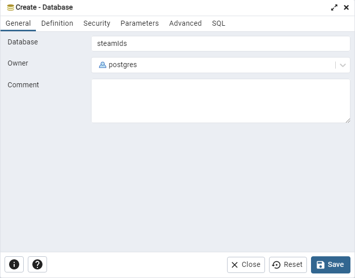
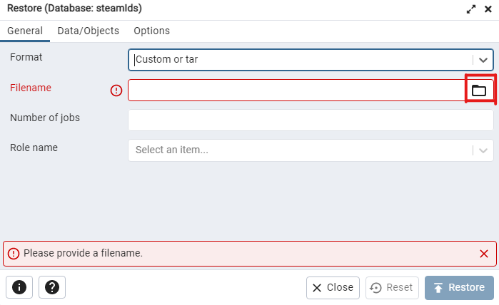
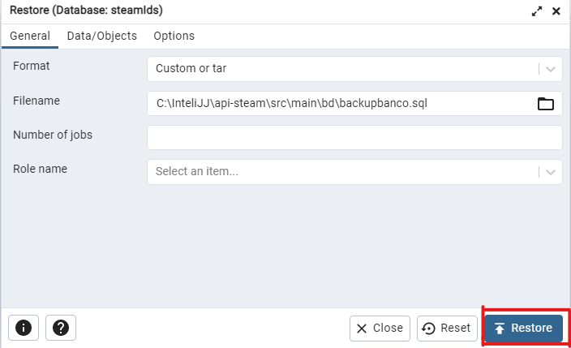
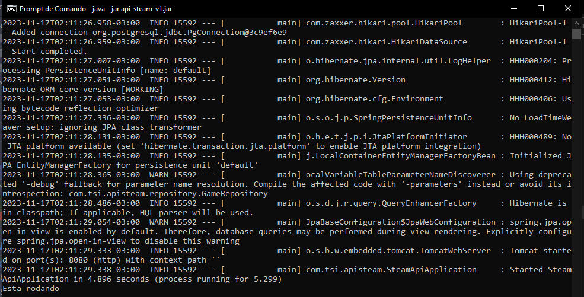

# api-conquistas-steam-back
Essa API foi desenvolvida para obter a quantidade de usuários que têm certa quantidade de conquistas em jogos da Steam.

## Requisitos
- Java 17
- PostgreSQL 14
- Pgadmin 4 (para restauração do banco de dados)

## Instalação

### Restaurando banco de dados

1. Baixe ou clone esse repositório com:
   ```
   git pull https://github.com/ja1za1/api-conquistas-steam-back
   ```
2. Abra o Pgadmin, crie um banco qualquer com nome de `steamIds` e nomeie o usuário `postgres` como dono.
   
   
   
3. Clique com botão direito no banco criado e depois clique em Restore... e clique na pasta destacada em vermelho.
   
   

4. Navegue até a pasta do projeto e vá para o diretório `src/main/bd` e selecione o arquivo de backup do banco e clique em Restore.
   
   

### Executando a API

Navegue até a pasta `src/main/jar`, abra o terminal e digite o comando:

```
java -jar api-steam-v1.jar
```

Caso a mensagem "Esta rodando" apareça no terminal, a API foi executada com sucesso e está pronta para receber requisições.

   

Obs.: Por motivos didáticos, o arquivo jar foi compilado com usuário e senha do banco respectivamente: postgres e 123456789. Portanto, caso a senha do seu usuário postgres não seja essa, não funcionará.
